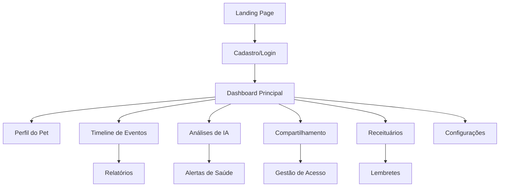

# Smart Pet Diary - Documento de Requisitos do Produto

## 1. Visão Geral do Produto

O Smart Pet Diary é um diário inteligente e bilíngue para pets que revoluciona o cuidado animal através de análise preditiva com IA e compartilhamento colaborativo. A plataforma permite que tutores, veterinários e cuidadores acompanhem a saúde e bem-estar dos pets de forma integrada e inteligente.

O produto resolve o problema da falta de acompanhamento sistemático da saúde pet, oferecendo insights baseados em IA para prevenção de problemas de saúde e facilitando a comunicação entre todos os envolvidos no cuidado do animal.

Mercado-alvo: Tutores de pets, veterinários e famílias que buscam tecnologia para melhorar o cuidado animal, com potencial de alcançar milhões de usuários no mercado pet brasileiro e internacional.

## 2. Funcionalidades Principais

### 2.1 Perfis de Usuário

| Papel | Método de Cadastro | Permissões Principais |
|-------|-------------------|----------------------|
| Tutor | Email ou redes sociais | Acesso completo ao perfil do pet, compartilhamento, relatórios |
| Veterinário | Cadastro profissional verificado | Acesso aos pets sob cuidado, prescrições, análises médicas |
| Cuidador/Família | Convite do tutor | Visualização e registro de eventos básicos |

### 2.2 Módulos de Funcionalidades

Nossa plataforma Smart Pet Diary consiste nas seguintes páginas principais:

1. **Página Inicial (Landing Page)**: seção hero, navegação, demonstração de funcionalidades, depoimentos, FAQ, call-to-action
2. **Dashboard do Pet**: timeline visual, análises de IA, alertas de saúde, métricas comportamentais
3. **Perfil do Pet**: informações básicas, histórico médico, fotos, documentos
4. **Relatórios**: relatórios mensais automáticos, gráficos de tendências, insights de IA
5. **Compartilhamento**: gerenciamento de acesso, convites para família/cuidadores
6. **Receituários**: gestão de medicamentos, lembretes inteligentes, histórico de prescrições
7. **Configurações**: preferências de idioma, notificações, privacidade

### 2.3 Detalhes das Páginas

| Nome da Página | Nome do Módulo | Descrição da Funcionalidade |
|----------------|----------------|----------------------------|
| Landing Page | Seção Hero | Apresentar headline impactante, proposta de valor, demonstração visual do produto |
| Landing Page | Como Funciona | Explicar funcionalidades principais: timeline, IA, relatórios, compartilhamento, receituários, suporte bilíngue |
| Landing Page | Benefícios | Destacar IA preventiva, facilidade de uso, painel intuitivo, segurança de dados |
| Landing Page | Depoimentos | Exibir feedback de tutores e veterinários para credibilidade |
| Landing Page | FAQ | Responder dúvidas sobre IA, privacidade, multiplataforma |
| Landing Page | CTA e Suporte | Conversão para cadastro/teste grátis, garantias de suporte |
| Dashboard | Timeline Visual | Exibir cronologia de eventos com fotos, marcos importantes, filtros por data |
| Dashboard | Análise de IA | Processar dados comportamentais (humor, energia, apetite), gerar insights preditivos |
| Dashboard | Alertas Inteligentes | Notificar mudanças comportamentais, lembretes médicos, recomendações preventivas |
| Perfil Pet | Informações Básicas | Gerenciar dados do pet, fotos, características, histórico médico |
| Relatórios | Relatórios Automáticos | Gerar relatórios mensais, análises de tendências, comparativos temporais |
| Compartilhamento | Gestão de Acesso | Convidar família/cuidadores, definir permissões, controlar visibilidade |
| Receituários | Gestão de Medicamentos | Registrar prescrições, configurar lembretes, acompanhar tratamentos |
| Configurações | Preferências | Configurar idioma (PT/EN), notificações, privacidade, sincronização |

## 3. Processo Principal

**Fluxo do Tutor:**
1. Acessa landing page e se cadastra
2. Cria perfil do pet com informações básicas
3. Registra eventos diários (alimentação, passeios, comportamento)
4. Recebe análises de IA e alertas preventivos
5. Compartilha acesso com família/veterinário
6. Consulta relatórios mensais automáticos

**Fluxo do Veterinário:**
1. Recebe convite de acesso do tutor
2. Analisa histórico e dados comportamentais
3. Registra consultas e prescrições
4. Configura lembretes de medicamentos
5. Acompanha evolução através de relatórios

## 4. Design da Interface do Usuário

### 4.1 Estilo de Design

- **Cores Primárias**: Azul petróleo (#2C5F7C) e verde suave (#4CAF50) para transmitir confiança e natureza
- **Cores Secundárias**: Laranja caloroso (#FF9800) para CTAs e branco (#FFFFFF) para backgrounds
- **Estilo de Botões**: Arredondados com sombra suave, efeito hover com transição
- **Tipografia**: Inter ou Roboto para legibilidade, tamanhos 16px (corpo), 24px (subtítulos), 32px+ (títulos)
- **Layout**: Design card-based com espaçamento generoso, navegação superior fixa
- **Ícones**: Estilo outline minimalista, relacionados a pets e saúde

### 4.2 Visão Geral do Design das Páginas

| Nome da Página | Nome do Módulo | Elementos de UI |
|----------------|----------------|-----------------|
| Landing Page | Seção Hero | Background gradiente, headline em destaque, botão CTA laranja, imagem de pets felizes |
| Landing Page | Como Funciona | Cards com ícones, layout em grid 3x2, animações suaves ao scroll |
| Landing Page | Benefícios | Ícones grandes, texto centralizado, cores contrastantes para destaque |
| Landing Page | Depoimentos | Cards com fotos de perfil, aspas estilizadas, rating com estrelas |
| Dashboard | Timeline | Layout vertical com linha temporal, cards de eventos, filtros superiores |
| Dashboard | Análise IA | Gráficos coloridos, métricas em destaque, indicadores visuais de status |
| Perfil Pet | Galeria de Fotos | Grid responsivo, modal para visualização ampliada, upload drag-and-drop |

### 4.3 Responsividade

O produto é mobile-first com adaptação completa para desktop. Otimizado para interação touch em dispositivos móveis, com navegação por gestos e interface simplificada para telas menores. Breakpoints: 320px (mobile), 768px (tablet), 1024px (desktop).