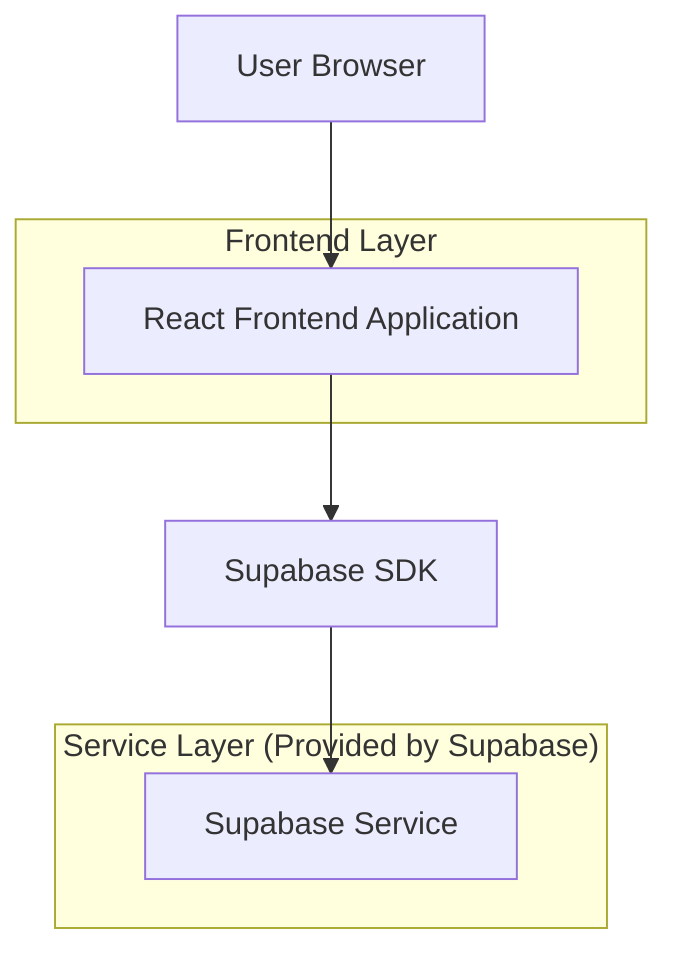
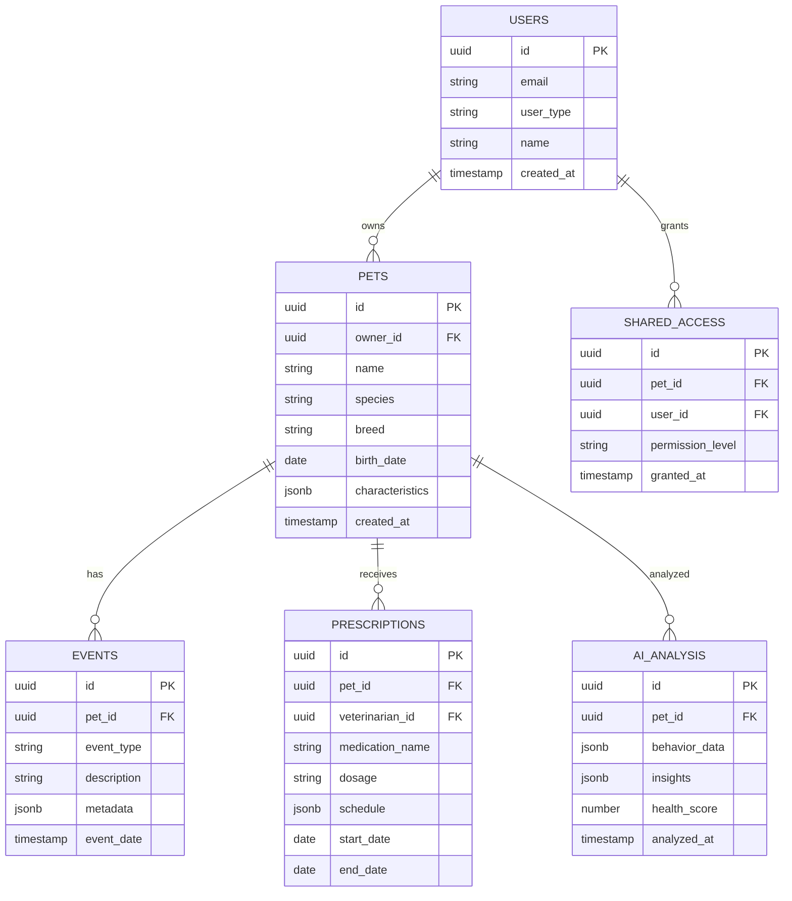

# Smart Pet Diary - Documento de Arquitetura Técnica

## 1. Design da Arquitetura



## 2. Descrição das Tecnologias

- Frontend: React@18 + TailwindCSS@3 + Vite + React Router + i18next (internacionalização)
- Backend: Supabase (Authentication, Database, Storage, Real-time)
- Bibliotecas Adicionais: Chart.js (gráficos), React Hook Form (formulários), Zod (validação)

## 3. Definições de Rotas

| Rota | Propósito |
|------|-----------|
| / | Landing page principal com hero, funcionalidades, depoimentos e FAQ |
| /dashboard | Dashboard principal com timeline do pet e análises de IA |
| /pet/:id | Perfil detalhado do pet com informações e histórico |
| /reports | Página de relatórios mensais e análises comportamentais |
| /prescriptions | Gestão de receituários e lembretes de medicamentos |
| /sharing | Configurações de compartilhamento com família e veterinários |
| /settings | Configurações de conta, idioma e privacidade |

## 4. Definições de API

### 4.1 APIs Principais

**Autenticação de Usuário**
```
POST /auth/v1/signup
```

Request:
| Nome do Parâmetro | Tipo | Obrigatório | Descrição |
|-------------------|------|-------------|-----------|
| email | string | true | Email do usuário |
| password | string | true | Senha (mínimo 8 caracteres) |
| user_type | string | true | Tipo: 'owner', 'veterinarian', 'caregiver' |

Response:
| Nome do Parâmetro | Tipo | Descrição |
|-------------------|------|-----------|
| user | object | Dados do usuário autenticado |
| session | object | Token de sessão |

**Gestão de Pets**
```
POST /rest/v1/pets
```

Request:
| Nome do Parâmetro | Tipo | Obrigatório | Descrição |
|-------------------|------|-------------|-----------|
| name | string | true | Nome do pet |
| species | string | true | Espécie (dog, cat, etc.) |
| breed | string | false | Raça do animal |
| birth_date | date | false | Data de nascimento |
| owner_id | uuid | true | ID do tutor |

**Análise de IA**
```
POST /rest/v1/ai-analysis
```

Request:
| Nome do Parâmetro | Tipo | Obrigatório | Descrição |
|-------------------|------|-------------|-----------|
| pet_id | uuid | true | ID do pet |
| behavior_data | object | true | Dados comportamentais (humor, energia, apetite) |
| date_range | object | true | Período para análise |

Response:
| Nome do Parâmetro | Tipo | Descrição |
|-------------------|------|-----------|
| insights | array | Lista de insights gerados pela IA |
| health_score | number | Pontuação de saúde (0-100) |
| recommendations | array | Recomendações preventivas |

## 5. Modelo de Dados

### 5.1 Definição do Modelo de Dados



### 5.2 Linguagem de Definição de Dados

**Tabela de Usuários (users)**
```sql
-- Criar tabela
CREATE TABLE users (
    id UUID PRIMARY KEY DEFAULT gen_random_uuid(),
    email VARCHAR(255) UNIQUE NOT NULL,
    user_type VARCHAR(20) NOT NULL CHECK (user_type IN ('owner', 'veterinarian', 'caregiver')),
    name VARCHAR(100) NOT NULL,
    language_preference VARCHAR(5) DEFAULT 'pt-BR',
    created_at TIMESTAMP WITH TIME ZONE DEFAULT NOW(),
    updated_at TIMESTAMP WITH TIME ZONE DEFAULT NOW()
);

-- Criar índices
CREATE INDEX idx_users_email ON users(email);
CREATE INDEX idx_users_type ON users(user_type);

-- Permissões Supabase
GRANT SELECT ON users TO anon;
GRANT ALL PRIVILEGES ON users TO authenticated;
```

**Tabela de Pets (pets)**
```sql
-- Criar tabela
CREATE TABLE pets (
    id UUID PRIMARY KEY DEFAULT gen_random_uuid(),
    owner_id UUID NOT NULL REFERENCES users(id),
    name VARCHAR(100) NOT NULL,
    species VARCHAR(50) NOT NULL,
    breed VARCHAR(100),
    birth_date DATE,
    characteristics JSONB DEFAULT '{}',
    profile_image_url TEXT,
    created_at TIMESTAMP WITH TIME ZONE DEFAULT NOW(),
    updated_at TIMESTAMP WITH TIME ZONE DEFAULT NOW()
);

-- Criar índices
CREATE INDEX idx_pets_owner_id ON pets(owner_id);
CREATE INDEX idx_pets_species ON pets(species);

-- Permissões Supabase
GRANT SELECT ON pets TO anon;
GRANT ALL PRIVILEGES ON pets TO authenticated;
```

**Tabela de Eventos (events)**
```sql
-- Criar tabela
CREATE TABLE events (
    id UUID PRIMARY KEY DEFAULT gen_random_uuid(),
    pet_id UUID NOT NULL REFERENCES pets(id),
    event_type VARCHAR(50) NOT NULL,
    description TEXT,
    metadata JSONB DEFAULT '{}',
    event_date TIMESTAMP WITH TIME ZONE NOT NULL,
    created_by UUID REFERENCES users(id),
    created_at TIMESTAMP WITH TIME ZONE DEFAULT NOW()
);

-- Criar índices
CREATE INDEX idx_events_pet_id ON events(pet_id);
CREATE INDEX idx_events_date ON events(event_date DESC);
CREATE INDEX idx_events_type ON events(event_type);

-- Permissões Supabase
GRANT SELECT ON events TO anon;
GRANT ALL PRIVILEGES ON events TO authenticated;
```

**Tabela de Análises de IA (ai_analysis)**
```sql
-- Criar tabela
CREATE TABLE ai_analysis (
    id UUID PRIMARY KEY DEFAULT gen_random_uuid(),
    pet_id UUID NOT NULL REFERENCES pets(id),
    behavior_data JSONB NOT NULL,
    insights JSONB DEFAULT '[]',
    health_score INTEGER CHECK (health_score >= 0 AND health_score <= 100),
    recommendations JSONB DEFAULT '[]',
    analysis_period DATERANGE,
    analyzed_at TIMESTAMP WITH TIME ZONE DEFAULT NOW()
);

-- Criar índices
CREATE INDEX idx_ai_analysis_pet_id ON ai_analysis(pet_id);
CREATE INDEX idx_ai_analysis_date ON ai_analysis(analyzed_at DESC);
CREATE INDEX idx_ai_analysis_score ON ai_analysis(health_score DESC);

-- Permissões Supabase
GRANT SELECT ON ai_analysis TO anon;
GRANT ALL PRIVILEGES ON ai_analysis TO authenticated;
```

**Dados Iniciais**
```sql
-- Inserir tipos de eventos padrão
INSERT INTO event_types (name, description, icon) VALUES
('feeding', 'Alimentação do pet', '🍽️'),
('walk', 'Passeio ou exercício', '🚶'),
('medication', 'Administração de medicamento', '💊'),
('vet_visit', 'Consulta veterinária', '🏥'),
('grooming', 'Higiene e cuidados', '🛁'),
('play', 'Tempo de brincadeira', '🎾');
```